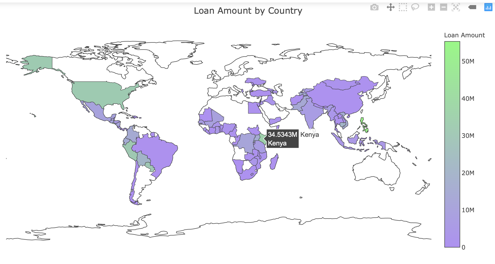
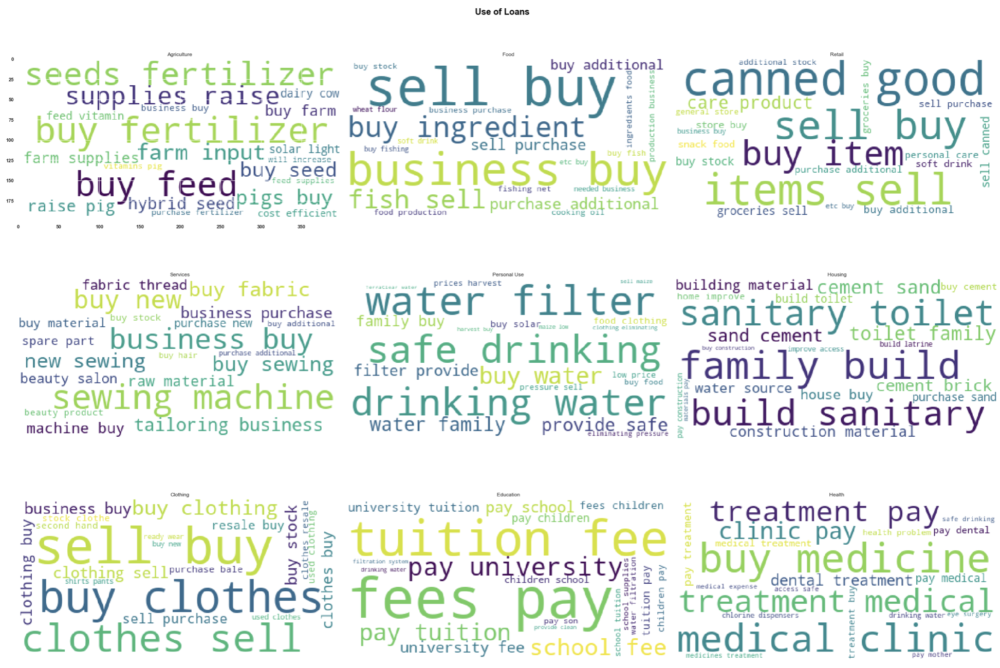
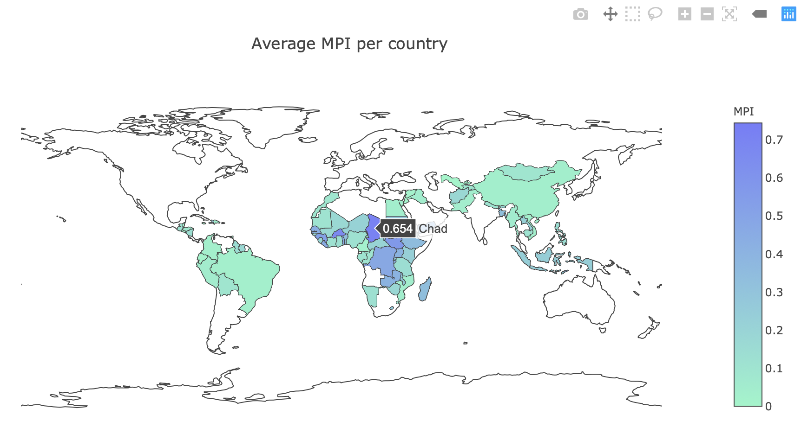

# Granular Poverty Index
* Poverty Thresholds:
  - Living < $1.90/day in undeveloped countries
  - Making <$69.00/day in the USA with a family of 4
780 million people living under this threshold
  - No access to safe drinking water, sanitation
  - Short life expectancy
  - 27/28 poorest countries are on Africa Continent
* US Poverty:
  - In 2017, 12.3% of all people lived in poverty
  - In 2018, 16.2% of all children (11.9 million kids) lived in Poverty USA
  - Senior poverty rate to 14.1%  in 2018
* Problem Statement:
  - To help ease poverty around the world ,governments/non-profit organizations need localized models that:
      + Identify poverty regions
      + Estimate the poverty of residents
 * Identify global poverty regions
 
* What is MPI ? 
  - Stands for Multidimensional Poverty Index
  - Created by United Nation Development Programme (UNDP)
  - Measures household and individually poverty levels in three criteria: health, education, and standard of living.
  - 1.3 billion people in countries around the world live in multidimensional Poverty.
* Using Word Cloud extracting texts from those surveys to create a word cloud graph, to have a general concepts of what microloan were used for.
  
* Three dimensions of Poverty (according to United Nations Development Programme (UNDP))
  - Health: 
      + Nutrition: Undernourished for both adult and children
      + Child mortality: Any child has died in the family in the five year before the survey.
  - Education: 
      + Years of schooling: No household member has completed six grade.
      + School attendance: Not attending school up to the eight grader
  - Standard of living:
      + Cooking fuel: Using dung, wood, charcoal or coal for cooking
      + Sanitation:  Sanitation  is not cleaned or shared with other households
      + Drinking water:  No access to safe drinking water, or water is far from home.
      + Electricity: Household has no electricity
      + Housing: Housing materials are made of clay,stone, natural materials
      + Assets: Not own more than one of these assets:
        - Radio, TV, telephone, computer, bicycle
        - Car or truck.
* Identify regions with Multiple Poverty Index -MPI
  
 
* Measuring Poverty Using Proxy Means Test (PMT):
 - What is Proxy Means Test (PMT)?
    - A test to estimate consumption when other income data isn't available or reliable. 
    - Results are used to determine the eligibility of a household/personal for government support/or fund
    - Using household characteristics to predict household welfare (consumption levels)
- PMT Methodology:
    - Collect household consumptions based on national consumption expenditure per capita data
    - Select poverty indicators based on household characteristics
    - Use multilinear regression model to estimate relationship between variables describing household characteristics and monetary value of household consumption
* PMT Model Algorithms:
* Modeling:
* Keys Takeaway
    - P-value < 0.05 signifies the variable in the model has no correlation with MPI-clusters
    - Changes in model variables are associated with changes in the MPI-clusters at the population level
    - The coef value indicates how much the mean of MPI changes given one-unit shift in the variable while holding other variables constant. This allows assess the effect of each variable in isolation from the others
    - When MPI _clusters increases, it will alert government/loan field-partners to allot assistance in that particular regions for that particular cause.
    - When MPI of the regions decreases,  government/ agents may lift aids for that clusters
    - Even if two regions have the same MPI, the causes for poverty are different, thus model should be modified accordingly
* Conclusions:
 - Our Granular Poverty Index works well when testing data from Columbia, Kenya, Philippines, Haiti.
 - It works well with large dataset (Columbia)
 - But doesn’t work well with small dataset (PMT model)
 - The larger the data, the better the results
 - The better the quality of the data, the better the results
* What will I do next?
    - So far the models are built using demographic characteristics and take country/ clusters as input.
    - If time is allowed, we should construct a mathematical formula to calculate distance from longitudes and latitudes within a cluster
    - Combining  demographic and geographic data will give a profound comprehension  of the locations and the nature of needs poor people which is the subject of this research

  

